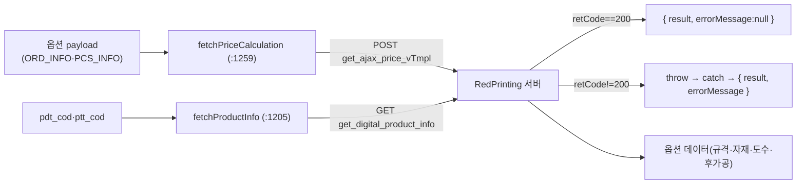

# 01 — 앱 API/유틸 레이어 워크스루 (`deob_05_app_api.js`)

> **정체:** Lodash 유틸 번들 + RedPrinting 서버 API 통신(제품정보·가격계산·S3·용지·템플릿) + 영어
> 번역 사전. **검증:** G1~G6 전부 **GO**(`03_verify/deob_05_app_api.js.verdict.md`). 구조 시그니처
> 바이트 동일(143725=143725) → 리네임/주석/포매팅만 변경(동작 보존).
>
> 인용은 `02_readable/deob_05_app_api.js` 기준. 근거 = 가독 소스·comment-map·verdict.

---

## 1. 섹션 목차 (comment-map 근거)

| 영역 | 위치 | 내용 |
|------|------|------|
| 파일 헤더 | `:1`(배너) | 모듈 정체. 후반부(스토어·RedWidgetSDK·Vue 컴포넌트)는 06으로 위임 명시 |
| Lodash 유틸 게터군 | 본문 상단(JSDoc 앵커) | `extractDefaultExport`·`getIsObject`·`getRootObject`·`getBaseGetTag`·`getNative`·`initDebounce`·`initIsEmpty` |
| API 통신 함수군 | `:1205`~ | `fetchProductInfo`·`fetchPriceCalculation`·`fetchS3FileInfo`·`fetchAvailableMaterials`·`downloadTemplate`·`downloadCoverTemplatePdf` |
| 영어 번역 사전 | `:1471` `TRANSLATIONS_EN` | UI 라벨/안내/에러 영어 대응(280+ 항목). 문자열 리터럴이라 불변 |
| (한국어 사전) | `:1498`(배너) | **본문 생략(TODO)** — 디옵 산출물 미포함. 복원 시 원본 mod_05 line 1080~1281 |

---

## 2. 핵심 함수 워크스루

### 2.1 가격 계산 — `fetchPriceCalculation` (`:1259`) ★돈 흐름

위젯에서 가장 중요한 함수. 선택 옵션으로 실시간 가격을 산출한다.

```js
// deob_05_app_api.js:1259
async function fetchPriceCalculation(priceRequestPayload, locale = "ko") {
  let responseData = null;
  try {
    const apiUrl = `${REDPRINTING_BASE_URL}/${locale}/product_price/get_ajax_price_vTmpl`;
    if (
      ((responseData = await (
        await fetch(apiUrl, {
          method: "POST",
          headers: { "Content-Type": "application/json" },
          body: JSON.stringify({ dataJson: priceRequestPayload.body }),  // :1271
        })
      ).json()),
      responseData.retCode !== 200)            // :1276 에러 판정
    )
      throw new Error(responseData.msg);
    return { result: responseData, errorMessage: null };
  } catch (error) {
    console.error("[RedWidgetSDK/ERROR] 가격 요청 실패 > ", error);
    // ...errorMessage 구성 후 { result, errorMessage } 반환
  }
}
```

**주해:**
- 엔드포인트 = `POST /{locale}/product_price/get_ajax_price_vTmpl`.
- 요청 body는 `{ dataJson: priceRequestPayload.body }` 형태. JSDoc(`:1257`)에 따르면 그 안의 계약
  키는 `ORD_INFO`·`PCS_INFO`·`price_gbn`·`mb_cust_cod`이며, 이들은 **서버 데이터 계약**(verdict G5
  preserve 보존 확인: `mb_cust_cod`·`price_gbn`·`ORD_INFO`·`PCS_INFO` 등).
- `retCode !== 200`이면 `Error(responseData.msg)`를 던진다(`:1276`).
- 실패 시에도 `null`을 던지지 않고 `{ result, errorMessage }`로 정상 반환 — 호출측이 에러 메시지를
  UI로 노출하도록 설계됨(추정 아님, catch 블록 구조 그대로).

> 참고: RedPrinting 가격 API는 PRICE=0을 정상 반환하지 않는다는 도메인 사실은 다른 하네스의 관측이며,
> 본 가독 소스만으로는 PRICE 값 범위를 단정하지 않는다(코드는 retCode만 검사).

### 2.2 제품 정보 조회 — `fetchProductInfo` (`:1205`)

```js
// deob_05_app_api.js:1205
async function fetchProductInfo(locale = "ko", productCode, patternCode) {
  // ...
  apiUrl = `${REDPRINTING_BASE_URL}/${locale}/product/get_digital_product_info?${queryParams}`;
  // ... GET 호출, retCode!==200 에러
}
```

- 엔드포인트 = `GET /{locale}/product/get_digital_product_info?pdt_cod=&ptt_cod=`(`:1217`).
- 제품의 전체 옵션 데이터(규격·자재·도수·후가공)를 반환(comment-map). `retCode!==200`이면 에러.
- 반환 형태 `{result, errorMessage}` — 가격 함수와 동일 패턴.

### 2.3 주문 가능 용지 조회 — `fetchAvailableMaterials` (`:1347`)

- `POST /{locale}/product/guide_product_paper`. `PDT_COD`/`PTT_COD` 조합으로 중복 제거 후 가이드
  이미지 URL을 합성해 반환(comment-map). `PDT_COD`·`PTT_COD`는 preserve 식별자(verdict G5).

### 2.4 템플릿 다운로드 — `downloadTemplate` (`:1395`) / `downloadCoverTemplatePdf`

- `downloadTemplate`: `POST /{locale}/product/get_download`(FormData). blob이 `application/zip`이
  아니면 에러. 임시 `<a>` 태그 클릭으로 다운로드(comment-map).
- `downloadCoverTemplatePdf`: `POST /{locale}/product/get_pdf_download`. 무선/트윈링 책자 표지 작업용.

### 2.5 Lodash 유틸 게터군 (지연 초기화)

comment-map JSDoc 근거. 모두 "지연 초기화 게터" 패턴(처음 호출 시 구현을 캐시):
- `getNative` — 객체에서 네이티브 함수 참조를 안전 획득(폴리필/래핑 배제). DataView·Map·Set·WeakMap 감지 기반.
- `initDebounce` — Lodash debounce. leading/trailing/maxWait 지원. **옵션 변경 시 가격 API 호출 빈도 제한에 사용**.
- `initIsEmpty` — Lodash isEmpty. 가격 요청 전 파라미터 유효성 검증에 사용.
- `extractDefaultExport`·`getIsObject`·`getRootObject`·`getBaseGetTag` — interop/타입 판별 보조.

---

## 3. 데이터 흐름 (입력 → 처리 → 출력)



---

## 4. 이 모듈에서 주의할 점

- **05는 위젯의 "데이터/유틸 절반"만** 담는다. SDK 진입점·스토어·Vue 컴포넌트·주문요약은 06에 있다(헤더 배너 명시).
- **API 필드명은 데이터 계약**(`PDT_COD`·`PTT_COD`·`PRICE`·`COD`·`mb_cust_cod`·`price_gbn` 등)이라
  리네임 금지·동결됨(플레이북 F4). 가독화는 **함수명·주석·포매팅**에서만 일어났다(verdict: applied=0
  rename, 변환 가치는 JSDoc 주입 + prettier).
- **한국어 번역 사전 미포함** — 본 파일로는 한국어 라벨을 확인할 수 없다(원본 mod_05 참조 필요).

근거: verdict(GO·G2 바이트 동일·G5 preserve 9/9 보존)·engineer-log(applied=0·JSDoc 13/13 착지)·comment-map.
