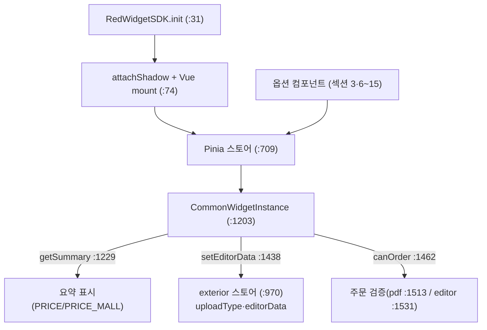

# 02 — 위젯 SDK · Pinia 스토어 · 기본 컴포넌트 워크스루 (`deob_06_app_widget_sdk.js`)

> **정체:** `RedWidgetSDK` 진입점(Shadow DOM·Vue 마운트) + 5개 Pinia 스토어 + 옵션 UI 컴포넌트 +
> 외부 호출용 위젯 인스턴스. **검증:** G1~G6 전부 **GO**
> (`03_verify/deob_06_app_widget_sdk.js.verdict.md`). 구조 시그니처 바이트 동일(115781) → 동작 보존.
>
> 인용은 `02_readable/deob_06_app_widget_sdk.js` 기준. 근거 = 가독 소스·comment-map(섹션 1~26)·verdict.

---

## 1. 섹션 목차 (comment-map 26섹션)

| 섹션 | 위치 | 내용 |
|------|------|------|
| 1 | `:19` | **RedWidgetSDK 클래스** — SDK 진입점(Shadow DOM·Vue 마운트·clientKey 검증) |
| 3 | `:126` | 기본 UI 컴포넌트(OptionRow 옵션 행) |
| 6~15 | `:381`~`:564` | ButtonRadio·Selector·MaterialFilters·Dosu·Sizes·HiddenPostPcs·VisiblePostPcs·SUB_MTR·S3Uploader·Uploader |
| 16~18 | `:593`~`:625` | 후가공 분류 유틸·업로드 설정·주문 상태 컴포저블 |
| 19~21 | `:650`~`:682` | Digital(범용)·Acrylic·Clothes(의류) 위젯 메인 컴포넌트 |
| 22 | `:709` | **Pinia 스토어 정의**(config·product·exterior·order·acc-order) |
| 23 | `:872` | 제품 코드별 설정 상수 |
| 24 | `:942` | **CommonWidgetInstance**(일반 제품 위젯 인스턴스) |
| 25 | `:1296` | AccWidgetInstance(부자재 위젯 인스턴스) |
| 26 | `:1379` | Shadow DOM CSS 링크 삽입 헬퍼 |

---

## 2. SDK 진입점 — `class RedWidgetSDK` (`:31`)

```js
// deob_06_app_widget_sdk.js:31
class RedWidgetSDK {
  constructor(clientKeyValue) {
    if (!ALLOWED_CLIENT_KEYS.includes(clientKeyValue))   // :41
      throw ...;  // red-mobile | red-pc 만 허용
  }
  // init(initConfig, callbacks): attachShadow + createApp + Pinia/VueQuery/DomPurify 주입
}
```

- **clientKey 검증:** `ALLOWED_CLIENT_KEYS = ["red-mobile", "red-pc"]`(`:1178`). 둘 중 하나가 아니면 생성자에서 거부(`:41`).
- **Shadow DOM 생성:** `targetElement.attachShadow({...})`(`:74`) — 호스트 페이지 CSS와 격리.
- **Vue 앱 마운트:** comment-map JSDoc — `createVueApp` + Pinia/VueQuery/DomPurify 주입 → `widget.css` 링크 삽입(`:1379`) → mount.
- **반환:** `CommonWidgetInstance`(`:1203`) — 외부에서 호출하는 위젯 API 객체.

---

## 3. Pinia 스토어 (섹션 22, `:709`)

| 스토어 | 위치 | 역할 (comment-map) |
|--------|------|--------------------|
| `useConfigStore` | (JSDoc 앵커) | 다국어 locale 상태·setLocale. `translate(key, params)`가 이 locale로 TRANSLATIONS 조회·치환 |
| `useProductStore` | (JSDoc 앵커) | baseInfo(제품 기준정보)·get/setProductBaseInfo |
| `useExteriorStore` | `:970` | **uploadType(editor\|pdf)·editorData·payloadForEditorConfig** — 파일업로드 vs 에디쿠스 경로 분기 |
| `useOrderStore` | (JSDoc 앵커) | orderData(주문 옵션·가격 결과)·get/setOrderData |
| `useAccOrderStore` | (JSDoc 앵커) | 부자재(ACC) 전용 주문 데이터 |

### 3.1 경로 분기의 심장 — `useExteriorStore` (`:970`)

```js
// deob_06_app_widget_sdk.js:970
const useExteriorStore = defineStore("exterior", () => {
  const uploadType = reactive({                 // :971  키별 editor|pdf 상태
    // default: ...
  });
  // setUploadType(type, key): uploadType[key||"default"] = type   (:975)
  const setEditorData = (data, key) => { ... };  // :980  에디터 데이터 설정
  return {
    uploadType,                                  // :1001
    setEditorData,                               // :1004
    // payloadForEditorConfig: uploadType[key||"default"]==="editor" && ...  (:1007)
  };
});
```

**주해:** `uploadType`은 **키별**(reactive 맵)로 관리되어, 한 주문 안에 여러 업로드 슬롯(예: 내지·표지)이
각각 editor 또는 pdf일 수 있게 한다. `payloadForEditorConfig`(`:1007`)는 `uploadType[key] === "editor"`
조건으로 에디터 설정 payload를 만든다 — 즉 **에디터 연동 여부는 이 스토어가 단일 진실원천**이다.

---

## 4. 위젯 인스턴스 — `CommonWidgetInstance` (`:1203`, 섹션 24)

`RedWidgetSDK.init()`이 반환하는 외부 호출 API. comment-map: getProductBaseInfo·getOrderData·
getSummary·setEditorData·canOrder 제공.

### 4.1 에디터 결과 주입 — `setEditorData` (`:1438`) ★위젯↔에디터 경계

```js
// deob_06_app_widget_sdk.js:1438
setEditorData(editorResultData) {
  if (!editorResultData) return this.editorStore.setEditorData(null);
  const enrichedData = { pdtCode: this.pdtCode, ...editorResultData },
    productBaseInfo = this.getProductBaseInfo(),
    processedData =
      enrichedData.type === "KOI"                         // :1447 분기
        ? processKoiEditorData(enrichedData, productBaseInfo)
        : processRpEditorData(enrichedData);
  processedData
    ? this.editorStore.setEditorData(processedData)       // 성공
    : console.error("[RedWidgetSDK/ERROR] 에디터에서 온 데이터가 없습니다 > ...");
}
```

**주해:** 에디터에서 돌아온 결과를 위젯 상태로 넣는 지점. `type === "KOI"`이면 KOI 편집기용
가공(`processKoiEditorData`), 아니면 RP 편집기용 가공(`processRpEditorData`). 가공 결과가 있으면
`exterior` 스토어에 저장, 없으면 에러 로그. (KOI/RP = 두 편집기 계열 — 구체 정의는 본 파일 범위 밖이라 미상.)

### 4.2 주문 가능 검증 — `canOrder` (`:1462`)

```js
// deob_06_app_widget_sdk.js:1462
canOrder() {
  // uploadTypeState = this.editorStore.uploadType  (:1482)
  for (const [uploadKey, uploadValue] of Object.entries(uploadTypeState)) { ... }  // :1487
  if (uploadTypeState.default === "pdf") { ... }                  // :1513  PDF 경로 검증
  // uploadTypeState.default === "editor" && ...                   // :1531  에디터 경로 검증
}
```

**주해:** `uploadType` 상태별로 검증 분기 — `pdf`면 파일 업로드 완료 여부, `editor`면 에디터 편집
완료 여부를 검사한다. 파일/가격/옵션 선택 완료를 종합해 주문 가능 여부를 낸다(comment-map).

### 4.3 주문 요약 — `getSummary` (`:1229`)

사이드바 표시용 주문 요약 생성. PRICE/PRICE_MALL 등 가격 필드를 모아 표시(comment-map AccModule 등에서 동일 필드 사용).

---

## 5. 부자재 인스턴스 — `AccWidgetInstance` (`:1296`, 섹션 25)

부자재(ACC) 전용. `getSummary`(`:1666`)·`canOrder`(`:1708`) 제공. 일반 인스턴스와 같은 외부 API
형태지만 부자재 옵션·가격 검증에 특화(comment-map).

---

## 6. 기본 옵션 UI 컴포넌트 (섹션 3·6~15)

| 컴포넌트 | 위치 | 역할 (comment-map) |
|----------|------|--------------------|
| OptionRow | `:126` | 옵션 한 행 레이블+컨트롤 레이아웃(withScopeId 격리) |
| ImageButton | (JSDoc) | 아이콘 체크박스(후가공 선택). 클릭 시 emit |
| PageDirection | (JSDoc) | 가로/세로 인쇄 방향 선택. 사이즈로 방향 자동 감지 |
| ButtonRadio | `:381` | 버튼형 라디오 그룹 |
| Selector | `:398` | 기본 드롭다운 |
| MaterialFilters | `:414` | 3단계 자재 필터 |
| Dosu | `:429` | 인쇄 도수(양면/단면) |
| Sizes | `:446` | 규격 선택 + 사이즈 유효성 검증 |
| HiddenPostPcs / VisiblePostPcs | `:472`/`:498` | 숨겨진 필수 후가공 / 선택 가능 후가공 |
| SUB_MTR | `:524` | 부자재 선택 행 |
| S3Uploader / Uploader | `:542`/`:564` | presigned URL 업로드 / PDF·에디터 통합 업로더 |

> 메모(work-units): 일부 컴포넌트(`classifyPostProcessOptions`·`buildUploadConfig`·`useOrderState`·
> 일부 의류 컴포넌트)는 이전 패스가 본문을 "원본 mod_06 line N과 동일" placeholder 주석으로 생략 —
> 바인딩 부재라 리네임 대상이 아니며, 해당 본문은 이 디옵 산출물에 미포함(미상).

---

## 7. 데이터 흐름 요약



근거: verdict(GO·G2 바이트 동일·G5 preserve 23종 카운트 일치)·comment-map(섹션 26 + JSDoc)·소스 라인.
