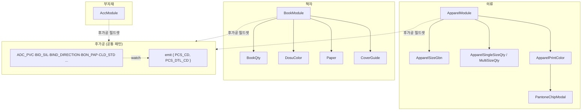

# 03 — Vue 주문 컴포넌트 워크스루 (`deob_07_app_components.js`)

> **정체:** 상품군별(의류·책자·부자재·후가공) 주문 UI를 그리는 Vue 3 컴포넌트(`defineComponent` +
> 렌더 함수). **검증:** G1~G6 전부 **GO**(`03_verify/deob_07_app_components.js.verdict.md`). 구조
> 시그니처 바이트 동일(427581) → 동작 보존.
>
> ⚠ **입력 절단 주의(verdict·comment-map 근거):** 이 파일의 입력 번들은 앞부분이 절단(truncation)되어
> 있었다. engineer는 cartographer가 합성 HEAD/TAIL로 브래킷 균형을 맞춘 `*.recovered.js`를 입력으로
> 썼고, G2 비교도 그 recovered.js 기준이다. 따라서 가독본 선두의
> `__recoveredApparelPrintAreaSetup` 블록은 **RedPrinting 원본 코드가 아니라 절단 복원 scaffold**다 —
> 이 블록의 식별자/구조는 무의미하며 동작과 무관(verdict "합성 scaffold는 원본 아님으로 명시" 지시).
>
> 인용은 `02_readable/deob_07_app_components.js` 기준. 근거 = 가독 소스·comment-map·verdict.

---

## 1. 섹션 목차 (comment-map)

| 섹션 | 위치 | 내용 |
|------|------|------|
| 1 | `:97` | 의류(Apparel) 인쇄 영역 컴포넌트(계속) — ※ line 105 orphan `}),` = 절단 경계 |
| 2~ | 본문(JSDoc 앵커) | 의류 컴포넌트군·책자(Book) 컴포넌트군·부자재(Acc) |
| 16~28 | `:2294` | 후가공(PostProcess) 개별 컴포넌트들 |
| (절단 경계) | `:2588` | 이하 후가공/수량 컴포넌트는 원본(4247줄)에만 존재 — 본 단편 미포함 |

---

## 2. 상품군 컴포넌트군

### 2.1 의류(Apparel) 컴포넌트군

| 컴포넌트 | 역할 (comment-map JSDoc) |
|----------|--------------------------|
| `ApparelSizeGbn` | 사이즈 구분(성인/아동) 라디오. options를 성인/아동 분류해 RadioList 렌더 |
| `ApparelSingleSizeQty` | 단일 사이즈 수량(Selector + 수량 입력). 변경 watch → update emit |
| `ApparelMultiSizeQty` | 멀티 사이즈 수량(사이즈별 +/- 버튼). `QUICK_ORD_YN`에 따라 경고 노출 |
| `PantoneChipModal` | 팬톤 컬러 선택 모달. 검색(공백 제거 후 `pantone_name` 매칭)·팔레트·미리보기 |
| `ApparelPrintColor` | 의류 인쇄 컬러(팬톤) 필드셋. PantoneChipModal 연동 |
| `ApparelModule` | 의류 메인 주문 컴포넌트 래퍼. 필드셋: 인쇄유형·컬러·사이즈·인쇄영역·팬톤·건명·포장·업로드 |
| `CheckmarkIcon` | 선택 표시용 인라인 SVG 아이콘(withScopeId) |

### 2.2 책자(Book) 컴포넌트군

| 컴포넌트 | 역할 (comment-map JSDoc) |
|----------|--------------------------|
| `BookQty` | 수량/내지장수. 수량선택 + 직접입력 토글. 토너/윤전별 최소수량·내지 최대장수 안내 |
| `DosuColor` | 인쇄도수 + 색상 2단 셀렉트. `PRN_CNT`/`CLR_CD`로 update emit |
| `Paper` | 용지 선택(종류 + 평량 `WGT_CD`). `MTRL_CD`/`MTRL_NM`/`MTRL_TYPE`로 emit |
| `CoverGuide` | 표지 가이드. 작업사이즈 미리보기 + 템플릿 다운로드. 가로제본 상품 분기 |
| `BookModule` | 책자 메인 래퍼. 내지(도수·용지·장수·업로드) + 표지(도수·용지·가이드·후가공·업로드) 그룹 |

### 2.3 부자재(Acc)

| 컴포넌트 | 역할 |
|----------|------|
| `AccModule` | 부자재 메인. 옵션 선택(캐스케이드/멀티/단일) + 수량 카운터 + 가격(`PRICE`/`PRICE_MALL`) 표시. 로딩 시 Skeleton |

---

## 3. 후가공(PostProcess) 컴포넌트군 (섹션 16~28, `:2294`)

**공통 패턴(comment-map 배너):**
`setup → selectedValue ref → handleSelect → watch로 PCS_CD/PCS_DTL_CD 구조 update emit → OptionRow + ImageButton 렌더`.

즉 모든 후가공 컴포넌트는 같은 골격을 따른다 — 선택값을 ref로 들고, 선택 핸들러에서 갱신하고, watch로
`{ PCS_CD, PCS_DTL_CD }` 형태(서버 계약 키)로 부모에 emit한다.

| 컴포넌트 | 역할 (comment-map JSDoc) |
|----------|--------------------------|
| `ADC_PVC_Module` | PVC 커버 후가공. 아이콘 선택. `PCS_CD=data.value`, `PCS_DTL_CD=선택값` |
| `BID_SIL_Module` | 실크 인쇄 후가공(속성값 선택 포함) |
| `BIND_DIRECTION_Module` | 제본방향. 자동 결정(가로→상단 `BPTOP`/세로→좌측 `BPLFT`) + A/B 회전(`BACK_ROT_YN`) |
| `BON_PAP_Module` / `BON_SHT_Module` | 본드용지 / 본드시트 후가공(아이콘 선택) |
| `CLD_STD_Module` | 달력규격 셀렉트 — **이 deob 슬라이스의 마지막 컴포넌트** |

`PAK_POL_Simple`/`PAK_POL_SimpleModule`(개별 포장 폴리백)도 동일 패턴(선택 시 `PCS_CD`/`PCS_DTL_CD` emit).

---

## 4. ★ 절단 경계 — 본 파일에 코드로 없는 것 (`:2588`)

comment-map이 명시적으로 기록한 **절단 경계**. 아래 컴포넌트들은 동일 패턴(`defineComponent → props
data/options → emits[update] → watch → PCS_CD/PCS_DTL_CD 변환)이나 **원본 mod_07(4247줄)에만 존재하고
본 단편(2607줄→가독본 4865줄)에는 코드로 미포함**(트레일링 주석 요약으로만 존재):

```
COT_DFT 코팅 · COT_SEG 부분코팅 · CVR_INN 속표지 · CVR_SWN 재봉 · DIR_MTR 직접자재 ·
END_PAP 면지 · INN_DFT 내지마감 · INS_COT 내부코팅 · LAB_FBR 라벨원단 · PAK_ETC 포장기타 ·
PAK_POL 폴리백 · PDT_WRK 작업방식 · PRT_IPK 개별포장표시 · PRT_WHT 화이트인쇄 ·
PRT_WHT_FACE 화이트면선택 · RIN_DFT 링제본 · ROU_DFT 라운딩 · SCO_DFT 스코딕스 ·
SUB_MTR_BC 보조자재 · WRK_MTR 작업자재 · Basic 기본자재 ·
CalendarQty 달력수량 · SetQty 세트수량 · SimpleQty 단순수량 · TotalQty 총수량
```

**다운스트림 주의:** 위 목록의 동작을 본 가독 소스만으로 추적할 수 없다(미포함). 필요 시 원본 mod_07
재추출이 필요하다(verdict routing: "향후 full-bundle 재추출로 비절단 deob 확보 권장").

---

## 5. 도메인 계약 키 (preserve·동결)

이 모듈에서 컴포넌트가 emit/참조하는 키는 대부분 **서버 데이터 계약**이라 동결됨(verdict G5: 172개
preserve 전부 verbatim 존재):

`PCS_CD`·`PCS_DTL_CD`·`PDT_CD`·`MTRL_CD`·`MTRL_NM`·`MTRL_TYPE`·`PRN_CNT`·`CLR_CD`·`WGT_CD`·
`COD`·`COD_NME`·`KOI_NME`·`PRICE`·`PRICE_MALL`·`HIDE_YN`·`GBN`·`QUICK_ORD_YN`·`BACK_ROT_YN` 등.
Vue 런타임 헬퍼(`createVNode`·`computed`·`ref`·`defineComponent` 등)도 free reference라 동결.

---

## 6. 컴포넌트 관계 (개요)



> 위 관계는 comment-map JSDoc의 "필드셋"·"하위 컴포넌트 조합" 서술 기준 개요다. 정확한 부모-자식 트리는
> 각 `*Module`의 렌더 함수에서 직접 확인 가능하며, 절단된 컴포넌트는 표현하지 않았다.

근거: verdict(GO·G2 recovered.js 기준 바이트 동일·G5 172/172 보존·절단 복원 정당성 입증)·comment-map(절단 경계 명시).
