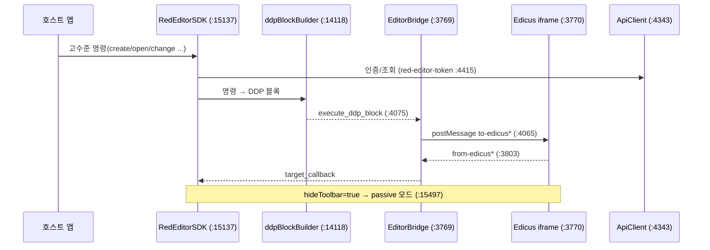

# 04 — 에디터 SDK 워크스루 (`deob_editor_sdk.js`)

> **정체:** RedPrinting 디자인 편집기(Edicus) 통합 SDK. `window.RedEditorSDK`로 노출되는 메인 클래스 +
> iframe postMessage 브릿지(`EditorBridge`) + makers API HTTP 래퍼(`ApiClient`) + DDP 블록 빌더 +
> 커스텀 탭 매니저. **버전 6.6.48**(`:8` 주석). **검증:** G1~G6 전부 **GO**
> (`03_verify/deob_editor_sdk.js.verdict.md`, attempt 2).
>
> 인용은 `02_readable/deob_editor_sdk.js` 기준. 원본 식별자(1~2자)는 cartography 기록 시 병기.
> 근거 = 가독 소스·comment-map·thirdparty-ranges·verdict·engineer-log.

용어: **DDP** = 에디터가 이해하는 명령 블록 포맷(이름 풀이는 본 소스 범위 밖, 미상). **passive 모드** =
툴바를 숨긴 임베드 편집 모드(아래 §6).

---

## 1. 주요 구성요소 (comment-map + work-units 근거)

| 구성요소 | 위치(가독) | 원본 식별자 | 역할 |
|----------|------------|-------------|------|
| `EditorBridge` | `:3769` | `Qe` | 에디터 iframe 통신 관리자. iframe 생성·URL 구성·postMessage 양방향 |
| `ApiClient` | `:4343` | `a` | makers.redprinting.net HTTP 래퍼. `red-editor-token` 인증·50분 토큰 갱신 |
| `sessionStorageManager` | `:13943` | `D` | Base64 인코딩 sessionStorage 관리(저장 시 btoa, 읽을 때 atob) |
| `ddpBlockBuilder` | `:14118` | `G` | SDK 고수준 명령 → 에디터 DDP 블록 변환(23 명령 타입) |
| `RedEditorSDK` | `:15137` | `t` | 메인 SDK 클래스. 생성자 + 45 프로토타입 메서드. `this.version=6.6.48` |
| `CustomTabManager` | `:18267` | `X` | 커스텀 탭(옵션 UI) 데이터 가공(소재 목록 추출·템플릿 매칭) |
| (export) | `:18944` | — | `windowRef.RedEditorSDK = RedEditorSDK` |

> 원본 식별자는 verdict/work-units가 기록한 매핑(예: EditorBridge=`Qe`·RedEditorSDK=`t`·ApiClient=`a`).
> 이 SDK는 거대 IIFE(`!(function(windowRef){...}`, 가독 `:114`부터) 안에 들어 있다(thirdparty-ranges).

---

## 2. EditorBridge — iframe postMessage 브릿지 (`:3769`)

```js
// deob_editor_sdk.js:3769
((editorBridge = {
  base_url: "https://edicusbase.firebaseapp.com",        // :3770 운영
  // ...
}).base_url = "https://edicusbase.firebaseapp.com"),
  (editorBridge.dev_base_url = "https://edicus-stage.firebaseapp.com"),  // :3790 개발
  (editorBridge._lastUpdatedAt = "20210609"),
  (editorBridge.init = function (t, e) {                   // :3792
    editorBridge._isDev = t;
    editorBridge.base_url = t ? editorBridge.dev_base_url : editorBridge.base_url;  // dev 분기
    e && (editorBridge.base_url = e);                      // 명시 base_url 오버라이드
    // messageListener 등록: from-edicus* 수신 처리
  });
```

### 2.1 수신 — `from-edicus*` (`:3803`)

`messageListener`가 `window` 메시지를 받아 JSON 파싱 후 `type`으로 분기:

```js
// deob_editor_sdk.js:3803
if ("from-edicus" == e.type ||
    "from-edicus-root" == e.type ||
    "from-edicus-tnview" == e.type)
  i.target_callback && i.target_callback(null, e);          // 일반 콜백
else if ("from-edicus-private" == e.type)                   // :3808 내부 프로토콜
  if ("waiting-for-extra-param" == e.action) { ... }
```

**주해:** 에디터(iframe)→SDK 방향은 `from-edicus*` 타입 메시지로 들어오고, 일반 타입은
`target_callback`으로 흘리고, `from-edicus-private`는 추가 파라미터 협상(`waiting-for-extra-param`)
같은 내부 프로토콜을 처리한다.

### 2.2 송신 — `to-edicus*` (`:4044`·`:4065`)

각 명령 메서드는 `{type, action, info}` 객체를 만들어 iframe에 postMessage한다:

```js
// deob_editor_sdk.js:4052  change_template 예시
(editorBridge.change_template = function (t, e) {
  var changeTemplateCommand = {
    type: "to-edicus-root",                 // 루트 명령
    action: "change-template",
    info: { ps_code: t, template_uri: e },
  };
  this.iframe_el.contentWindow.postMessage(JSON.stringify(changeTemplateCommand), "*");  // :4061
});
```

**주해:** SDK→에디터 방향은 `to-edicus` / `to-edicus-root` / `to-edicus-tnview` / `to-edicus-preview`
타입(`:4065`·`:4044`·`:4279`·`:4287`)으로 나간다. `postMessage(..., "*")`로 origin 와일드카드 송신.
명령 메서드는 `create_project`·`open_project`·`edit_template`·`change_template`·`change_layout`·
`execute_ddp_block`·`open_preview`·`show_tnview`·`show_gallery` 등 다수(소스 `:3943`~).

---

## 3. ApiClient — makers API HTTP 래퍼 (`:4343`)

```js
// deob_editor_sdk.js:4343
var ApiClient = (function () {
  // XMLHttpRequest 기반.
  // 매 요청에 red-editor-token 헤더 인증:
  //   xMLHttpRequest.setRequestHeader("red-editor-token", self2.token)  (:4415 외)
  // 50분 간격 토큰 자동 갱신 (comment-map)
})();
```

**주해:** `makers.redprinting.net`과 통신하는 인증 HTTP 클라이언트(comment-map). 모든 요청에
`red-editor-token` 헤더를 붙이고(`:4415`·`:4440`·`:4466` 등 다수), 토큰은 50분 간격 자동 갱신.
싱글턴 인스턴스 `apiClientInstance`(원본 `en`, 36회 참조)로 SDK 내부에서 공유(comment-map).

---

## 4. RedEditorSDK — 메인 클래스 (`:15137`)

```js
// deob_editor_sdk.js:15137
RedEditorSDK = (function () {
  // 생성자 + 45 프로토타입 메서드
  // this.version = 6.6.48
  // sdkState.mode = "standard" (기본, :15144)
})();
// ...
windowRef.RedEditorSDK = RedEditorSDK;   // :18944  전역 export
```

**메서드 카테고리(comment-map JSDoc):** 템플릿 / 프로젝트 / 에디터 UI / VDP / 라이프사이클 / 인증 /
이벤트 / 조회 / 주문 — 총 45개 프로토타입 메서드. 구체 메서드 시그니처는 클래스 본문(`:15137`~`:18266`,
verdict 섹션 라인 10398-11801 대응)에서 직접 확인.

**상태 객체 `sdkState`**(원본 `K`, 47회 참조, `:518` JSDoc):
- `mode`: `standard | passive`
- `deviceTarget`: `pc | mobile`

---

## 5. ddpBlockBuilder — DDP 블록 변환 (`:14118`)

```js
// deob_editor_sdk.js:14118
ddpBlockBuilder = function (t, e) { ... };  // 23 명령 타입 처리
```

**주해:** SDK의 고수준 명령을 에디터가 실행할 수 있는 DDP 블록으로 변환하는 빌더(원본 `G`, 21회 참조).
`EditorBridge.execute_ddp_block`(`:4075`)과 짝을 이뤄, 빌더가 만든 블록을 브릿지가 iframe으로 보낸다(추정:
두 메서드 이름·역할의 정합으로 본 연결을 본문 호출로 직접 확인 권장).

---

## 6. passive 모드 (`:15497`·`:15995`)

```js
// deob_editor_sdk.js:15497
((e.hideToolbar = _argN.hideToolbar), (sdkState.mode = "passive")),
// ...
run_mode: e.hideToolbar ? "passive" : "standard",   // :15712
edit_mode: e.showSetting ? "design" : "standard",    // :15713
```

**주해:** `hideToolbar` 옵션이 켜지면 `sdkState.mode = "passive"`로 전환되고, 에디터로 보내는
`run_mode`도 `passive`가 된다. passive = 툴바를 숨긴 임베드 편집 모드(편집 UI 최소화). `edit_mode`는
`showSetting` 여부로 `design`/`standard` 분기. 두 곳(`:15497`·`:15995`)에서 동일 전환이 일어난다 —
서로 다른 진입 메서드의 같은 처리로 추정.

---

## 7. sessionStorageManager — Base64 저장 (`:13943`)

```js
// deob_editor_sdk.js:13943
var sessionStorageManager = function (t, e) {
  // 값이 있으면: JSON.stringify 후 btoa(encodeURIComponent(...))로 저장 (userId는 64자 절단)
  // 값이 없으면: atob로 디코딩하여 반환
};
```

**주해:** 인증/세션 데이터를 Base64로 인코딩해 sessionStorage에 저장·조회하는 유틸(원본 `D`, 90회
참조). `getAuthState`(원본 `B`)가 여기서 editorToken/userId를 읽어 `{user, token}` 인증 상태를 만든다.

---

## 8. 서드파티 경계 (리네임·수정 제외)

| 서드파티 | 가독 좌표 | 처리 |
|----------|-----------|------|
| Babel transpile 헬퍼(head) | `:13`~`113` | exclude(상단 유지) |
| Sentry @sentry/browser v5.22.0 | `:122`~`3760` | fold(배너+추출본 분리) |
| Babel Polyfill + regeneratorRuntime | `:4635`~`13902` | fold |

코어 SDK 앱 로직은 폴리필 직후 `:13903`부터 재개된다. 분리 추출본은
`deob_editor_sdk.js.thirdparty.js`(418KB). 서드파티 식별자는 미변경(verdict G3 GO·zone 내 라벨 0).

---

## 9. 데이터 흐름 (SDK ↔ 에디터)



---

## 10. 이 모듈에서 주의할 점

- **거대 IIFE 단일 번들** — 앱 로직(`:114`~)이 한 클로저 안에 있어 모듈 경계가 라인 범위로만 구분된다.
- **원본 식별자가 1~2자였던 코어** — engineer가 `scope.rename`으로 52개 IIFE 바인딩 + 구조적 라벨
  522건을 의미/역할 이름으로 바꿨다(engineer-log). 일부 잔여 short는 minifier 관례 임시명(loop index·
  scratch register)이라 의미명 부여 불가 → free-ref로 정직 기록(05-method §4).
- **DDP 포맷·KOI 프로토콜 세부**는 본 소스의 명시 범위 밖이라 미상 — 명령 `action` 문자열로만 추적 가능.

근거: verdict(GO·attempt 2·G2 동작보존 4건 prettier 정규화로 확정·G3 토큰 잔존·G5 free-ref 정직)·
comment-map(11 JSDoc)·thirdparty-ranges(3)·engineer-log(applied 52 + structural 522).
